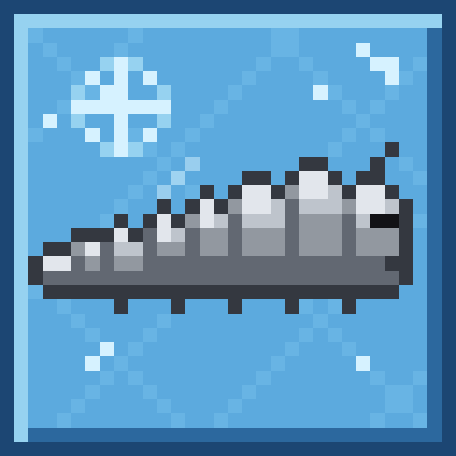

<p align="center">
  
</p>

<h1 align="center">FrozenSilverfish</h1>

<p align="center">
  <a href="https://hangar.papermc.io/ghiacciolodev/FrozenSilverfish">Hangar</a> ·
  <a href="https://github.com/ghiacciolodev/FrozenSilverfish/releases">GitHub Releases</a>
</p>

A small Paper 26.2 plugin that removes the AI from silverfish while keeping their physics. It was written to reduce the lag caused by armadillo farms, without changing how many silverfish they produce.

## Why

Our server has armadillo farms: 12 stations with 20 armadillos each, all with the Infested effect. When an armadillo gets hit it spawns silverfish. The silverfish are carried by water to a killing chamber, where a player kills them with a Sweeping Edge sword by hitting an armor stand.

That works, but it produces a lot of silverfish, and every one of them runs its AI every tick: looking for players, pathfinding towards them, looking for blocks to hide in, waking up other silverfish. With that many of them the server TPS drops.

Reducing the spawns was not an option, because the whole point of the farm is to produce silverfish. So the idea was to keep the same number of silverfish and make each one cheaper for the server.

## What it does

Every silverfish that enters a world gets its AI turned off. A frozen silverfish no longer:

- looks for, chases or attacks players
- walks around on its own
- hides inside blocks
- wakes up other silverfish
- swims up to the surface of water
- walks off a campfire it landed on

These things keep working as before:

- gravity
- being pushed by flowing water
- knockback
- taking damage, including sweeping edge damage
- XP when a player kills it

So the farm works the same way: the silverfish still fall, still travel along the water streams and still die to the sword. They just stop thinking.

The two things they can't do anymore, swimming up and walking off campfires, are handled by the plugin, see [Drowning](#drowning) and [Campfires](#campfires).

The plugin only changes silverfish. Armadillos and every other mob are left alone.

## How it works

### setAware instead of NoAI

The plugin calls `Mob#setAware(false)` on each silverfish.

The vanilla `NoAI` tag (`setAI(false)` in the API) is not the same thing. It turns off the AI and also the movement of the mob: a NoAI mob doesn't fall, isn't pushed by water and stays where it is. That would break the water transport of the farm.

`setAware(false)` only turns off the AI goals. The mob still runs its physics every tick, so it falls, floats along the water and can be knocked back.

### When the plugin applies it

- When a silverfish is added to a world. This covers every way a silverfish can appear: the Infested effect, infested blocks, spawn eggs, spawners, commands, and silverfish loaded from chunks that were saved earlier. The plugin listens to Paper's `EntityAddToWorldEvent` for this.
- When the plugin starts, to all silverfish that are already loaded.
- When you run `/fsf reload`, to all loaded silverfish.

Each silverfish frozen by the plugin gets the scoreboard tag `frozen_silverfish`, so you can always tell which ones were modified. For example `/kill @e[type=silverfish,tag=frozen_silverfish]` kills only those.

### Only what the plugin changed

The plugin keeps track of what it changed itself, and only ever undoes that. This matters if other plugins on your server also touch silverfish, for example a mob stacker.

- It only freezes silverfish that have their AI on. If a silverfish already has its AI off without the `frozen_silverfish` tag, some other plugin did that, so FrozenSilverfish leaves it alone: it doesn't tag it, doesn't change its collisions and never turns its AI back on.
- It only turns collisions off on silverfish it froze, and only if their collisions are on. When it does, it stores a marker (`frozensilverfish:collisions_off`) in the entity's persistent data. If collisions were already off because of another plugin, there's no marker and the plugin doesn't touch them.
- With `disable-collisions: false` the plugin doesn't touch collisions at all, except to turn them back on where its own marker is.

Because the only silverfish it freezes are ones that had their AI on, "restoring" always means turning the AI back on. There's no previous state to remember.

### What is saved on the entity

This matters for reloading and uninstalling.

- The aware flag is saved with the entity. A frozen silverfish stays frozen after a restart, after its chunk is unloaded and loaded again, and even after the plugin is removed.
- The `frozen_silverfish` tag and the `frozensilverfish:collisions_off` marker are saved with the entity.
- The collision setting itself is not saved. When a silverfish with the marker is loaded again, the plugin turns its collisions off again.
- Drowning prevention is not saved. The plugin does it while it is running.

When the plugin is turned off in the config, or a world is removed from the `worlds` list, the plugin undoes what it changed. Silverfish with the tag get their AI back and lose the tag. Silverfish with the marker get their collisions back and lose the marker. This happens to loaded silverfish when you run `/fsf reload`, and to the others when their chunk is loaded. Anything another plugin changed stays as it is.

### Drowning

Swimming up to the surface is also part of the AI. A frozen silverfish sinks in water, and silverfish have their eyes very close to the ground, so even shallow flowing water covers their head. Without help they drown after about 15 to 20 seconds in water, which can happen in a long water stream or while they wait in the killing chamber. They would die without giving XP.

With `prevent-drowning: true` (the default) the plugin cancels drowning damage for frozen silverfish. They still run out of air, they just don't take damage from it. This costs almost nothing: the damage event only fires about once per second for a silverfish that is actually drowning. Silverfish with their AI on are not affected, because they swim up by themselves.

### Campfires

Many armadillo farms keep the armadillos on campfires, so that they get hurt all the time and Infested keeps spawning silverfish. Infested throws each new silverfish in a random direction, and most of them fall off the campfire. The ones that land on top of it used to walk off by themselves, following the nearest player. Frozen silverfish don't, so they stay on the campfire and burn to death before reaching the killing chamber, without giving any XP.

In a test with 12 stations of 20 armadillos on campfires, this is what happened to 85% of the silverfish.

With `push-off-campfires: true` (the default), every time a campfire hurts a frozen silverfish, the plugin gives it a small push towards one of the four sides, chosen at random among the ones that aren't a wall. Other campfires count as open, because they are low and a silverfish slides over them. If all four sides look closed, the push goes in a completely random direction. A campfire hurts a silverfish about twice a second, so if one push isn't enough, the next one comes half a second later, until the silverfish falls off.

This doesn't cost anything for silverfish that aren't on a campfire. There is no task and no scan of the entities: the plugin only reacts to the campfire damage, looks at 4 blocks and sets the velocity. The damage itself is not cancelled, so a silverfish that somehow can't get off still dies like before and doesn't pile up.

One limit: the plugin decides what is a wall by looking at the block type. A block like a slab or a trapdoor that leaves a gap a silverfish could pass under counts as a wall. If a station has such blocks on all four sides, the push just goes in a random direction and still works. It would only go wrong if a station had one open side leading nowhere and the real exits were all slabs or trapdoors.

### Collisions

With `disable-collisions: true` the plugin also calls `setCollidable(false)` on the silverfish it froze. They stop pushing each other and other mobs, and they are no longer affected by entity cramming. In the benchmark below this saved a lot of time when many silverfish were packed together.

Two things to know:

- Without cramming, nothing limits how many silverfish can pile up in one block. That's fine if the farm kills them as soon as they arrive, but if nobody is in the killing chamber while the armadillos are being hit, they will keep piling up.
- Collisions are turned off on the server only. The Minecraft client doesn't know about it, so if you stand among the silverfish your own player may still look like it's being pushed. That push is calculated by your client and doesn't cost the server anything.

## Requirements

- Paper 26.2
- Java 25 (Paper 26.2 needs it anyway)

The plugin uses only the Paper API. It has no other dependencies.

## Installation

1. Download the jar from the [releases page](https://github.com/ghiacciolodev/FrozenSilverfish/releases), or build it yourself (see [Building from source](#building-from-source)).
2. Put `FrozenSilverfish-<version>.jar` in the `plugins` folder of your server.
3. Restart the server.

On the first start the plugin creates `plugins/FrozenSilverfish/config.yml` and freezes all loaded silverfish.

## Configuration

The config file is `plugins/FrozenSilverfish/config.yml`. After changing it, run `/fsf reload`. You don't need to restart the server.

This is the default config. It is also the recommended one, see [Recommended configuration](#recommended-configuration):

```yaml
enabled: true
disable-collisions: false
prevent-drowning: true
push-off-campfires: true
worlds: []
```

The numbers below come from the [performance benchmark](#performance-benchmark) with 2000 silverfish on land, compared with silverfish that have their AI on.

### enabled

Default: `true`

Turns the plugin on or off.

- `true`: every silverfish in the active worlds gets its AI turned off. On its own this saved about 20% to 35% of the time silverfish cost.
- `false`: the plugin stops freezing silverfish, and undoes what it changed: the ones it froze get their AI back, and the ones it removed collisions from get them back. Loaded silverfish are restored on `/fsf reload`, the others when their chunk is loaded. Use this before uninstalling, see [Uninstalling](#uninstalling).

### disable-collisions

Default: `false` (it was `true` in versions 1.0.1 to 1.1.0)

Also turns off collisions for frozen silverfish. See [Collisions](#collisions) for the details.

- `false`: the plugin doesn't touch collisions. Frozen silverfish push each other and other mobs like normal, and entity cramming still kills them when more than 24 are in the same spot. If you switch from `true` to `false`, the collisions the plugin turned off are turned back on.
- `true`: frozen silverfish don't push each other or other mobs, and entity cramming doesn't affect them. Together with the AI off this saved about 35% to 57% on land and 42% to 49% in water, compared with about 20% to 35% with the AI off alone. The difference grows with the number of silverfish that are close together.

The risk is that nothing limits how many silverfish can pile up. That's why it is off by default. Turn it on only if silverfish are always killed soon after they arrive. See [Recommended configuration](#recommended-configuration).

### prevent-drowning

Default: `true`

Frozen silverfish can't swim up, so they sink and drown after about 15 to 20 seconds in water. See [Drowning](#drowning).

- `true`: the plugin cancels drowning damage for frozen silverfish. In the tests a frozen silverfish stayed 30 seconds under water at full health, and 2000 frozen silverfish stayed alive under water during the whole benchmark. Its cost is already included in the water numbers of the benchmark.
- `false`: frozen silverfish drown like any mob that can't swim. Only use this if you actually want that, for example if you don't care about XP and want silverfish to disappear by themselves.

Silverfish with their AI on are not affected by this option, because they swim up by themselves.

### push-off-campfires

Default: `true`

Frozen silverfish can't walk off a campfire and burn on it. See [Campfires](#campfires).

- `true`: when a campfire hurts a frozen silverfish, the plugin pushes it towards an open side until it falls off. In a test with 12 stations of 20 armadillos on campfires, 1.2% of the silverfish died on a campfire, compared to 85% without the push.
- `false`: frozen silverfish that land on a campfire stay there and burn.

It only matters for farms with campfires. In other farms it never runs.

### worlds

Default: `[]`

The worlds where the plugin is active, by name, for example `[world, world_nether]`.

- `[]` (empty list): the plugin is active in all worlds.
- A list of names: the plugin is active only in those worlds. Silverfish in other worlds keep their AI, and the ones the plugin had frozen get it back.

Keep in mind that the plugin freezes every silverfish in an active world, not only the ones from farms. Silverfish from strongholds, infested blocks in the mountains or spawners will also be harmless there. If that matters for your server and the farm is in a separate world, list only that world.

World names are case sensitive. If a name in the list doesn't match a loaded world, the plugin writes a warning in the console at startup and in the reply to `/fsf reload`. It's only a warning, because a world managed by another plugin may load later.

### Recommended configuration

The recommended configuration is the default one. It is meant for a server where players build their own farms:

```yaml
enabled: true
disable-collisions: false
prevent-drowning: true
push-off-campfires: true
worlds: []
```

**Why `disable-collisions: false`.** With collisions off, entity cramming no longer kills silverfish. If a farm keeps running while nobody kills the silverfish, for example because the player is away or AFK, they pile up without any limit, and a few thousand of them are enough to bring the TPS down a lot. With collisions on, cramming kills the silverfish above 24 in the same spot, which puts a hard limit on how many can accumulate.

The cost is that a farm left running without anyone killing silverfish loses the ones that die from cramming, and that the saving is a bit smaller: about 20% to 35% with only the AI off, compared with 35% to 57% with collisions off too. That is still a lot, and it can't take the server down.

What the tests support:

- In a test farm with 4 stations of armadillos, silverfish still travelled along the water streams to the killing chamber and died to a Sweeping Edge hit on the armor stand, with collisions both on and off.
- With `prevent-drowning: true` no frozen silverfish drowned, in the farm or in the benchmark.
- With `push-off-campfires: true`, in a test farm with 12 stations of 20 armadillos on campfires, 98.8% of the silverfish got off the campfires alive, compared to 15% without it.
- With `disable-collisions: false`, cramming brought 40 frozen silverfish in the same block down to 24 within 5 seconds, like vanilla.

`disable-collisions: true` still makes sense if you control every farm on the server and you are sure silverfish are always killed soon after they arrive, for example on a small server or a private farm. Then you get the bigger saving, but nothing stops them from piling up if someone leaves a farm running.

Set `worlds` if you want silverfish outside your farm world to keep their AI, as explained above.

## Commands and permissions

All commands need the `frozensilverfish.admin` permission, which ops have by default. `/fsf` is a short alias for `/frozensilverfish`.

- `/fsf reload` reloads the config, applies it to all loaded silverfish and tells you how many were updated. Silverfish that were already in the right state are not counted. It also shows the settings now in use and any warning about the `worlds` list.
- `/fsf status` shows the plugin version, whether it is enabled and in which worlds, whether collisions are disabled and drowning is prevented, how many silverfish are loaded, how many were frozen by this plugin and how many had their collisions turned off by it. It also shows how many silverfish have their AI off without being frozen by this plugin. If that number isn't 0, another plugin is turning off the AI of silverfish too.

The settings in use are also written to the console when the server starts.

## Test results

All tests were run on a local test server: Paper 26.2 build 129, Java 25.0.4, Windows 11, AMD Ryzen 5 5600, 32 GB RAM (2 GB for the server), flat world, simulation distance 4.

### Functional tests

These tests were run on version 1.1.1 with a script that sends commands to the server through RCON and checks the result. Commands can't show whether an entity is collidable or has had its AI turned off by the API, so for these checks a small helper plugin was loaded on the test server only. It reads those values and can also act as "another plugin" that turns off the AI or the collisions of a silverfish.

The scripts and the helper are in the [testing](testing) folder, with instructions to run them on your own test server.

All 32 checks passed, with no errors from the plugin in the console.

| What was tested | How | Result |
|---|---|---|
| Freeze | Summon a silverfish with `disable-collisions: false` | AI off, `frozen_silverfish` tag, collisions still on, no marker |
| Gravity | Summon a silverfish 5 blocks above the ground | It falls to the ground and takes fall damage |
| No movement | Watch the same silverfish for 3 seconds | Its position doesn't change |
| Water transport | Summon a silverfish at the start of a flowing water channel | It is carried more than 3 blocks along the channel in 5 seconds |
| Damage | `/damage` 3 on a frozen silverfish | Health goes from 8 to 5 |
| Collisions off | `disable-collisions: true` and `/fsf reload` | Collisions off, marker added |
| Collisions back on | `disable-collisions: false` and `/fsf reload` | Collisions on, marker removed |
| Cramming, no collisions | 40 frozen silverfish in the same block, `max_entity_cramming` at 24, collisions off | All 40 still alive after 15 seconds |
| Cramming, collisions | Same silverfish after turning collisions back on | Cramming brings them down to 24 or fewer |
| AI turned off by another plugin | The helper turns off the AI of a silverfish before FrozenSilverfish sees it, with `disable-collisions: true` | FrozenSilverfish doesn't tag it and doesn't change its collisions |
| Same, plugin disabled | `enabled: false` and `/fsf reload` | That silverfish still has its AI off |
| Collisions turned off by another plugin, option off | The helper turns off collisions of a frozen silverfish, `disable-collisions: false`, `/fsf reload` | Collisions stay off |
| Same, plugin disabled | `enabled: false` and `/fsf reload` | AI back on, tag removed, collisions still off |
| Collisions turned off by another plugin, option on | The helper turns off collisions, then `disable-collisions: true` | No marker is added |
| Same, option off again | `disable-collisions: false` | Collisions stay off |
| Status | Compare `/fsf status` with counts from `/execute if entity` | Loaded and frozen counts match |
| Status, other plugin | `/fsf status` with the silverfish made unaware by the helper still loaded | It is counted as "without AI but not frozen by this plugin" |
| Unknown world | `worlds: [wrold]` and `/fsf reload` | The reply warns that `wrold` is not loaded. The same warning appears in the console at startup |
| World filter | `worlds: [world_nether]` | Silverfish in the overworld are restored |
| World filter back | `worlds: []` | Frozen again, collisions off again |
| Chunk unload | Freeze a silverfish in a far chunk with collisions off, unload the chunk | The silverfish is no longer loaded |
| Chunk load | Load the chunk again | Still frozen, collisions off again |
| Disabled while unloaded | Unload the chunk, `enabled: false`, load the chunk | AI back on, collisions back on, tag and marker removed |
| Drowning, option off | Frozen silverfish in water 2 blocks deep, `prevent-drowning: false` | It drowns within 25 seconds |
| Drowning, option on | Same with `prevent-drowning: true` | After 30 seconds it is out of air but at full health |
| Campfire push on | Frozen silverfish on a lit campfire in a glass cell open on one side, `push-off-campfires: true` | Within 6 seconds it is off the campfire and alive |
| Campfire push off | Same with `push-off-campfires: false` | It stays on the campfire and burns within 8 seconds |
| Drowning, AI on | Plugin disabled, same water | The silverfish swims and is at full health after 25 seconds |
| Before restart | Freeze a silverfish with collisions off | AI off, collisions off, marker |
| After restart | Stop and start the server | Still frozen, collisions off again |
| Startup | Start the server | No errors or warnings from the plugin |

Tested by hand on version 1.0.0, in a test farm with 4 stations of armadillos with Infested, water streams and a killing chamber: silverfish reach the killing chamber and die to a Sweeping Edge sword hit on the armor stand, with both `disable-collisions: false` and `true`. The changes in 1.0.1 only affect silverfish whose AI or collisions were changed by another plugin, so they don't change this.

### Campfire tests

These tests used real armadillos with Infested standing on lit campfires, with Regeneration so they didn't die. The campfire hurts them all the time, so Infested keeps spawning silverfish, like in a farm. A helper plugin counted the silverfish spawned by Infested and the ones that died on a campfire.

**Where the silverfish land.** With campfires out in the open, none of 93 silverfish stayed on a campfire: Infested throws them far enough. With each campfire in a glass cell open on one side, 21 of 81 (26%) stayed on top. So the problem depends on the shape of the station.

**One side open.** 5 cells like that. Each row is a separate run of 60 to 90 seconds, so the numbers of spawns are different:

| | Spawned | Died on a campfire |
|---|---|---|
| No push | 160 | 33 (21%) |
| Push in a fully random direction | 119 | 14 (12%) |
| Push towards an open side (the version in 1.1.0) | 139 | 0 |

**Like a real farm.** 12 stations, each one campfire with 20 armadillos on it (240 armadillos in total), a glass ring one block above the campfire that armadillos can't pass under but silverfish can, and a glass block on top. 45 seconds each, nobody killing the silverfish:

| | Spawned | Died on a campfire | Alive at the end |
|---|---|---|---|
| No push | 3224 | 2736 (85%) | 488 |
| Push | 3235 | 39 (1.2%) | 3196 |

At the end of the push phase 87 silverfish were still on a campfire, because the campfires were turned off while they were being pushed. With new spawns stopped and the campfires lit again for 10 seconds, none were left on a campfire: 82 got off and 5, already hurt, died.

**About MSPT in this test.** The server used 7.1 ms per tick without the push and 25.7 ms with it. That is not the cost of the push. With the push 6.5 times more silverfish stayed alive, because nobody was killing them, and more living silverfish cost more. In a real farm they are killed in the killing chamber, so how much it costs depends on how many are alive at the same time. The push itself only runs for silverfish that are burning, about twice a second each, and reads at most 4 blocks.

This also means that on a farm where most silverfish used to burn on the campfires, more of them now reach the killing chamber. The farm gives much more XP, and the server has somewhat more silverfish to handle at the same time. Each one still costs about half as much as a silverfish with its AI.

### Performance benchmark

The goal was to measure how much time silverfish cost per server tick without the plugin, with the plugin, and with the plugin and all its options on. `prevent-drowning` was `true` in every phase.

Setup:

- A closed glass box of 60 by 60 blocks, far from anything else, with glass floor and roof so silverfish can't hide in blocks or escape.
- One player standing on the roof in survival mode. Silverfish ignore players in creative, so with their AI on they keep trying to reach this player without success. This is close to what happens in the farm while someone is in the killing chamber.
- Monster spawning off, and entity cramming off during the test, so the number of silverfish stays the same in every phase.

There were two scenarios:

- Land: silverfish on the dry floor of the box.
- Water: the floor of the box covered with one layer of still water after the silverfish are summoned. This is closer to a farm, where silverfish spend their time in water. Silverfish with AI swim at the surface. Frozen silverfish sink, run out of air and are kept alive by drowning prevention, so its cost is included in these numbers.

For each scenario and number of silverfish there were three phases:

1. AI on: the plugin disabled. This is how silverfish behave without the plugin.
2. AI off: the plugin enabled with `disable-collisions: false` (the default config since 1.1.1).
3. AI off and no collisions: the plugin enabled with `disable-collisions: true`.

In every phase the silverfish from the previous phase were removed and new ones were summoned at random positions on the floor. After 70 seconds the tick time was read with Paper's `/mspt` command (average over the last 10 seconds). The number of silverfish alive was checked at the end of each phase, and none had died in any phase.

The whole benchmark was run twice, in opposite order:

- Pass 1 (version 1.0.0): land before water, fewer silverfish before more, and in each group AI on first, then AI off, then no collisions.
- Pass 2 (version 1.0.1): water before land, more silverfish before fewer, and in each group no collisions first, then AI off, then AI on.

The reason for pass 2 is that the Java virtual machine gets faster as it warms up, so a fixed order could favour whatever runs later. In pass 1 the phases with the plugin always ran after the one without it. In pass 2 it was the other way round. The changes in 1.0.1 don't affect freshly spawned silverfish, which is all the benchmark uses.

Results, in milliseconds per tick. A tick can take up to 50 ms before the TPS drops below 20. Each cell shows pass 1 / pass 2. The percentages compare each column with AI on in the same pass.

Land (without silverfish the server used 1.0 / 0.7 ms per tick):

| Silverfish | AI on | AI off | AI off, no collisions |
|---|---|---|---|
| 500 | 5.1 / 4.8 ms | 3.8 / 3.8 ms (25% / 21% less) | 3.2 / 3.1 ms (37% / 35% less) |
| 1000 | 9.8 / 9.6 ms | 6.7 / 6.2 ms (32% / 35% less) | 5.7 / 5.0 ms (42% / 48% less) |
| 2000 | 22.1 / 22.0 ms | 15.4 / 15.9 ms (30% / 28% less) | 9.6 / 10.5 ms (57% / 52% less) |

Water (without silverfish the server used 0.8 / 0.9 ms per tick):

| Silverfish | AI on | AI off | AI off, no collisions |
|---|---|---|---|
| 1000 | 12.2 / 12.2 ms | 9.9 / 8.3 ms (19% / 32% less) | 7.1 / 7.0 ms (42% / 43% less) |
| 2000 | 28.1 / 27.3 ms | 20.9 / 20.4 ms (26% / 25% less) | 14.2 / 14.3 ms (49% / 48% less) |

The two passes agree within a few points, so the order of the phases didn't change the result. Two earlier runs on land, during development, gave similar numbers too (23% to 33% less with AI off, 34% to 49% less with collisions off too).

What this means:

- With the default config (AI off, `disable-collisions: false`), silverfish cost about 20% to 35% less than normal ones.
- With collisions off too (`disable-collisions: true`), they cost about 35% to 57% less. With many silverfish close together, that is about half.
- Silverfish still run their physics, and collisions between them get more expensive the more they are packed together. That is why turning off collisions matters more at 2000 silverfish than at 500.
- Silverfish in water cost more than on land in every phase, but the saving is about the same.
- In the water scenario every frozen silverfish was out of air, so drowning prevention was working for all of them at the same time. Its cost is already included in the water numbers.
- The plugin doesn't make an unlimited number of silverfish free. If a farm produces them faster than they are killed, the lag will come back. See [Other things that can help](#other-things-that-can-help).

These are ranges from two passes, not exact figures. Don't read them as "the plugin saves exactly 57%".

Limits of this test:

- It is a synthetic test in a box, not a real farm. Silverfish in a farm move through water streams and gather in the killing chamber, so the numbers on a real server will be different.
- The absolute numbers depend on the hardware. A slower server will show higher values, but the differences between the columns should be similar.
- Each number is a single 10 second average, and there are only two passes. That's enough to see the size of the saving, not to give precise statistics. A spark profile of your own server with the farm running is the best check, see below.

### Result on a real server

This is not from the test server above, but from the server the plugin was made for, whose hardware I don't know. The largest armadillo farm there used to bring the server down to about 14 TPS while running. With the plugin installed and collisions turned off, the server stays at 20 TPS most of the time, and drops to about 19.4 at worst.

This was measured with version 1.0.x, before the campfire push. If that farm keeps its armadillos on campfires, many silverfish were probably burning before reaching the killing chamber, so with 1.1.0 more of them survive and the server has more silverfish to handle at the same time. See [Campfire tests](#campfire-tests).

## Checking the result on your own server

Measure the server while the farm is running, once with the plugin disabled and once with it enabled. Paper's `/mspt` command gives a quick number. For more detail use [spark](https://spark.lucko.me/):

```
/spark profiler start
```

Let it run for a few minutes with the farm active, then stop it with `/spark profiler stop` and compare the two reports. With the plugin enabled, the time spent on silverfish AI (pathfinding and goal selectors) should mostly disappear.

## Other things that can help

FrozenSilverfish makes each silverfish cheaper, but 2000 silverfish are still 2000 entities that the server ticks, moves and sends to players. If you need more, these Paper and Spigot settings are worth a look. They are not part of the plugin and they apply to all mobs, not only silverfish, so change them carefully and measure before and after.

- `collisions.max-entity-collisions` in `config/paper-world-defaults.yml` (default 8). Limits how many other entities each entity collides with per tick. A lower value makes packed mobs cheaper, but changes how mobs push each other everywhere.
- `entity-tracking-range.monsters` in `spigot.yml` (default 96). How far away players receive updates about monsters. A lower value means less network traffic for silverfish that players can't see anyway.
- The farm itself: fewer silverfish alive at the same time is always cheaper, for example with a shorter water stream or a killing chamber that is always manned while the armadillos are being hit.

## Uninstalling

The aware flag is saved with the entity, so if you just remove the plugin, the silverfish that were frozen stay frozen forever. Without the plugin they would also drown in water, because drowning prevention stops with it.

To remove it cleanly:

1. Set `enabled: false` in the config and run `/fsf reload`. This undoes the plugin's changes on all loaded silverfish.
2. Leave the plugin installed for a while, so that silverfish in chunks that load later are restored too. If all your silverfish are in areas that are usually loaded, this step is quick. `/fsf status` shows how many loaded silverfish are still frozen by this plugin.
3. Stop the server and remove the jar and the `plugins/FrozenSilverfish` folder.

Unloading or reloading the plugin while the server is running (with `/reload` or a plugin manager) is not supported. Frozen silverfish stay frozen, and until the plugin is loaded again they are not protected from drowning. Restart the server instead.

## Building from source

You need Java 25. If it isn't installed, Gradle downloads it automatically the first time.

```
./gradlew build
```

On Windows use `gradlew.bat build`. The jar ends up in `build/libs`.

Every push to the repository is also built by GitHub Actions, see [.github/workflows/build.yml](.github/workflows/build.yml). The jar of each build can be downloaded from the Actions tab.

The Paper API version is pinned in `build.gradle.kts` to the build the plugin was tested with (`26.2.build.129-stable`). Change it on purpose after testing with a newer build.

## License

FrozenSilverfish is released under the MIT License. See [LICENSE](LICENSE).
